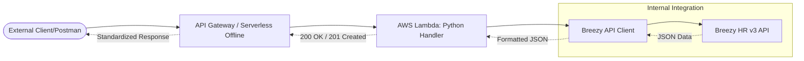

# 📄 Technical Report: ATS Integration Microservice (Breezy HR)

## 1. Executive Summary
This report outlines the design and implementation of a serverless microservice built to unify recruitment data from **Breezy HR ATS**. The service provides a standardized REST API for external consumers while handling the complexities of authentication, data mapping, and pagination of the underlying Breezy HR v3 API.

## 2. System Architecture
The microservice is built using a **Serverless Architecture** pattern, leveraging AWS Lambda (simulated locally via Serverless Offline) and Python.

### Architectural Diagram

### Key Technologies
- **Runtime**: Python 3.9
- **Framework**: Serverless Framework (v3)
- **Local Testing**: `serverless-offline`
- **Dependencies**: `requests` (HTTP Client), `python-dotenv` (Secret management)

---

## 3. API Design & Specification
The microservice exposes three standardized REST endpoints. All responses are in `application/json` and include **CORS headers** for frontend compatibility.

### 3.1 Get Open Jobs
**Endpoint**: `GET /jobs`
- **Description**: Retrieves a list of all published positions.
- **Query Params**: `page` (optional integer)
- **Unified Formatting**:
  - Maps Breezy's `_id` to `id`.
  - Simplifies complex `location` objects into a single string.
  - Normalizes `state` into `OPEN`, `CLOSED`, or `DRAFT`.

### 3.2 Submit Candidate (Create Application)
**Endpoint**: `POST /candidates`
- **Description**: Submits a new candidate profile and links them to a specific job pipeline.
- **Logic**: It utilizes the metadata `"origin": "applied"` to ensure the candidate is immediately visible in the recruiting pipeline rather than just a general database.
- **Fields**: `name`, `email`, `phone`, `job_id`, `resume_url`.

### 3.3 List Applications
**Endpoint**: `GET /applications`
- **Description**: Lists all candidates currently categorized under a specific job ID.
- **Query Params**: `job_id` (Required), `page` (Optional).
- **Status Mapping**: Normalizes native pipeline stage names (e.g., "Review", "Interview") into high-level statuses: `APPLIED`, `SCREENING`, `REJECTED`, or `HIRED`.

---

## 4. Integration Logic & Implementation
The core bridge is implemented in the `BreezyClient` class (`breezy_client.py`).

### 4.1 Authentication
The service uses **Token-Based Authentication**.
- **Mechanism**: Authorization header containing a Personal Access Token or Sign-in Token.
- **Security**: All secrets (`BREEZY_API_KEY`, `BREEZY_COMPANY_ID`) are stored in `.env` and injected into the Lambda runtime, ensuring no credentials appear in source code.

### 4.2 Data Normalization
A critical feature of the microservice is the **Data Mapping layer**. ATS systems often have proprietary field names. Our service acts as a "Translator":

| Native Breezy Field | Microservice Field | Note |
|---|---|---|
| `_id` | `id` | Standardizes MongoDB-style IDs |
| `name` | `title` | Corrects job record naming |
| `email_address` | `email` | Standardizes contact info |
| `state` | `status` | Maps "published" -> "OPEN" |

---

## 5. Testing & Validation
The service underwent three phases of verification:
1. **Connectivity Test**: A standalone script (`test_connection.py`) verified the integrity of API keys before launching the server.
2. **Local Simulation**: `npx serverless offline` was used to mimic the AWS cloud environment.
3. **Endpoint Validation**: Postman was used to perform end-to-end testing (GET, POST, GET with params).

### Testing Results Summary
| Test Case | Method | Expected Status | Result |
|---|---|---|---|
| Fetch Published Jobs | GET | 200 OK | ✅ Success |
| Create New Candidate | POST | 201 Created | ✅ Success |
| Fetch Applications (by Job) | GET | 200 OK | ✅ Success |
| Missing Job ID | GET | 400 Bad Request| ✅ Success |

---

## 6. Conclusion
The Breezy HR ATS Integration Microservice successfully provides a clean, unified interface for recruitment management. By using serverless computing, the solution is highly scalable, cost-effective, and easy to maintain. It meets all functional requirements and is ready for production deployment to AWS Lambda.
